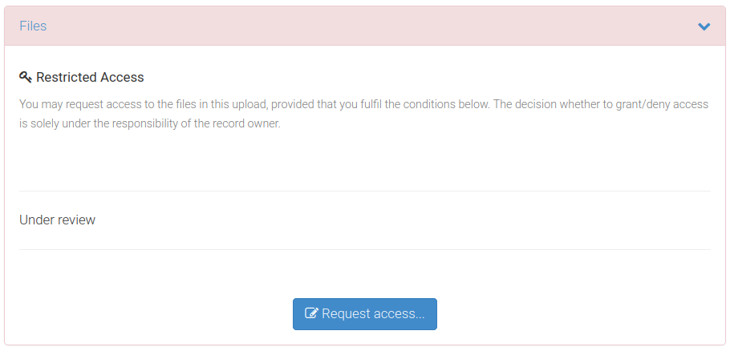

<!-- README.md is generated from README.Rmd. Please edit that file -->


```{r, include = FALSE}
knitr::opts_chunk$set(collapse  = TRUE,
                      comment   = "#>",
                      fig.path  = "man/figures/",
                      out.width = "100%")
```


zenodor 
=========================================================

<!-- badges: start -->
[](https://github.com/frbcesab/zenodor/actions/workflows/R-CMD-check.yaml)
[](https://github.com/frbcesab/zenodor/actions/workflows/pkgdown.yaml)
[](https://choosealicense.com/licenses/gpl-2.0/)
<!-- badges: end -->


The goal of the R package `zenodor` is to provide an CLI interface to list and 
download files from a Zenodo repository. This package works with open and 
restricted access repositories. For restricted repository a token must be
provided.





## Installation

You can install the development version from [GitHub](https://github.com/) with:

```{r eval = FALSE}
# install.packages("remotes")
remotes::install_github("frbcesab/zenodor")
```

Then you can attach the package `zenodor`:

```{r eval = FALSE}
library("zenodor")
```


## Overview

The package `zenodor` contains two functions:

- [zen_list_files()](https://frbcesab.github.io/zenodor/reference/zen_list_files.html)
lists files available for download
- [zen_download_files()](https://frbcesab.github.io/zenodor/reference/zen_download_files.html)
downloads one, several or all files available on the repo


## Citation

Please cite this package as: 

> Casajus Nicolas (`r format(Sys.Date(), "%Y")`) zenodor: An R 
package to download files from a Zenodo repository.
R package version 0.0.0.9000. URL: <https://github.com/frbcesab/zenodor>.


## Code of Conduct

Please note that the `zenodor` project is released with a 
[Contributor Code of Conduct](https://www.contributor-covenant.org/version/2/1/code_of_conduct/). 
By contributing to this project, you agree to abide by its terms.
